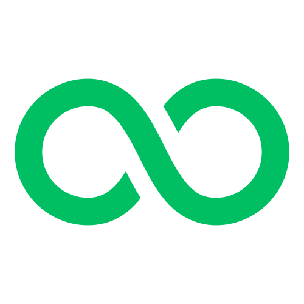

# OctoFund 🐙

## 📜 Descrição

**OctoFund** é um projeto que explora o sistema numérico octal, um sistema de numeração com base em 8 dígitos (0 a 7). Este sistema é frequentemente utilizado em programação de computadores e eletrônica digital para representar números de forma compacta. O objetivo do projeto é fornecer uma compreensão profunda do sistema octal e suas aplicações práticas.

## 🌐 Demonstração

Para uma demonstração completa do projeto, acesse nosso site: [OctoFund Homepage](link-para-o-site)

## 🔧 Funcionalidades

- **Conversão de números decimais para octal**: Transforme números na base 10 para a base 8.
- **Conversão de números octais para decimais**: Converta números da base 8 para a base 10.
- **Explicação detalhada do funcionamento do sistema octal**: Entenda como o sistema octal funciona e como ele é usado.
- **Exemplos de aplicação do sistema octal em programação e eletrônica digital**: Veja como o sistema octal é aplicado em contextos práticos.

## 📚 Como Contribuir

Sinta-se à vontade para contribuir com o projeto! Você pode fazer isso de várias maneiras:

1. **Abrir issues**: Relate bugs ou sugira melhorias.
2. **Submeter pull requests**: Faça alterações e envie suas melhorias.
3. **Participar da discussão**: Junte-se à comunidade e ajude a resolver problemas.

## 📫 Contato

Se você tiver dúvidas ou precisar de mais informações, entre em contato conosco através do [e-mail de suporte](mailto:suporte@octofund.com).

---

Obrigado por visitar o OctoFund! 🌟
