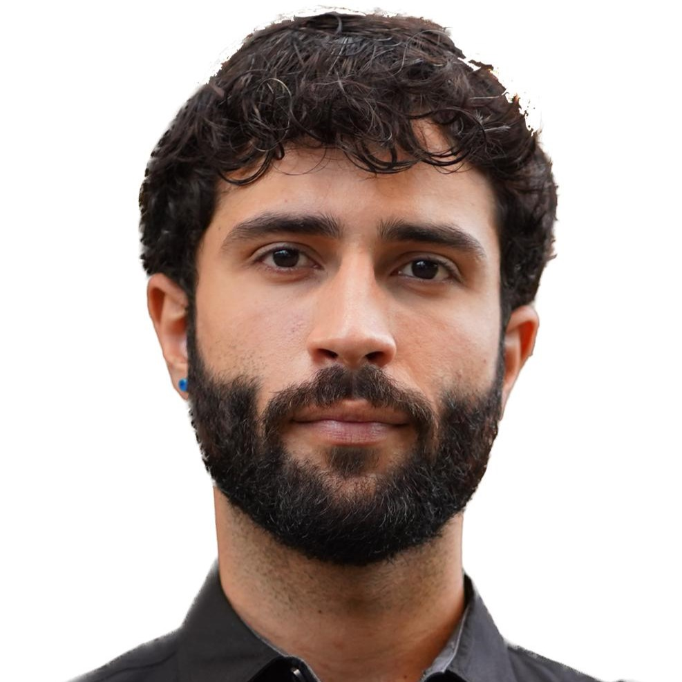

# OctoFund

## Descrição

**OctoFund** é um projeto que explora o sistema numérico octal, um sistema de numeração com base em 8 dígitos (0 a 7). Este sistema é frequentemente utilizado em programação de computadores e eletrônica digital para representar números de forma compacta. O projeto visa fornecer uma compreensão profunda do sistema octal e suas aplicações práticas.

## Demonstração

Acesse o site do projeto para uma demonstração completa: [OctoFund Homepage](https://lucascarv1804.github.io/octofund/homepage/index.html)

## Funcionalidades

- Conversão de números decimais para octal
- Conversão de números octais para decimais
- Explicação detalhada do funcionamento do sistema octal
- Exemplos de aplicação do sistema octal em programação e eletrônica digital

### Dev's

